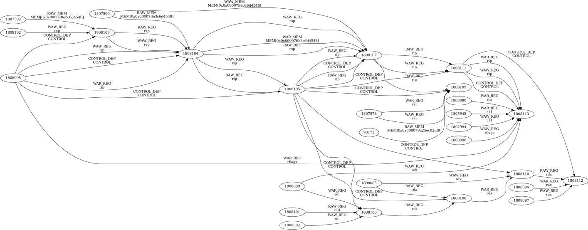

# PIN-Based Instruction Dependency Analyzer and ILP Estimator

A dynamic binary instrumentation tool built using Intel PIN to analyze instruction-level dependencies and estimate Instruction Level Parallelism (ILP) in real program executions.

The tool dynamically traces instructions, detects data and control dependencies, constructs a dependency graph (DAG), and computes parallelism metrics that help evaluate the execution characteristics of a program.

---

## Overview

Modern processors exploit Instruction Level Parallelism (ILP) to execute multiple instructions simultaneously. However, dependencies between instructions limit the amount of parallel execution that can be achieved.

This project instruments a program during runtime and identifies:

- Register dependencies
- Memory dependencies
- Flag dependencies
- Control dependencies

Using these dependencies, the tool constructs a Directed Acyclic Graph (DAG) representing execution constraints and estimates the available ILP of the program.

---

## Features

### Instruction Tracing

Captures runtime information for every executed instruction:

- Instruction sequence number
- Program Counter (PC)
- Assembly instruction
- Source registers
- Destination registers
- Memory read addresses
- Memory write addresses
- Branch information
- Flag usage information

Output:

```text
full_trace.out
```

---

### Dependency Analysis

The analyzer detects the following dependency types.

#### Register Dependencies

- RAW (Read After Write)
- WAR (Write After Read)
- WAW (Write After Write)

#### Memory Dependencies

- RAW Memory
- WAR Memory
- WAW Memory

#### Flag Dependencies

Tracks dependencies propagated through processor status flags (RFLAGS).

#### Control Dependencies

Tracks dependencies introduced by branch instructions.

Output:

```text
dependencies.out
```

---

### Dependency Graph Generation

A Directed Acyclic Graph (DAG) is generated where:

- Nodes represent instructions
- Edges represent dependencies

Output:

```text
dag.dot
```

The graph can be visualized using Graphviz.

Example:

```bash
dot -Tpng dag.dot -o dag.png
```

---

### ILP Estimation

The generated DAG is analyzed to compute:

- Critical Path Length
- Maximum Parallelism
- Average ILP

Output:

```text
ilp.out
```

---

## Dependency Types

| Dependency Type | Description                              |
| --------------- | ---------------------------------------- |
| RAW_REG         | Register Read After Write                |
| WAR_REG         | Register Write After Read                |
| WAW_REG         | Register Write After Write               |
| RAW_MEM         | Memory Read After Write                  |
| WAR_MEM         | Memory Write After Read                  |
| WAW_MEM         | Memory Write After Write                 |
| FLAG_DEP        | Dependency through RFLAGS                |
| CONTROL_DEP     | Dependency caused by branch instructions |

---

## Internal Workflow

The analyzer operates in four stages.

### 1. Dynamic Instruction Tracing

Intel PIN intercepts every executed instruction and records:

- Instruction metadata
- Register accesses
- Memory accesses
- Branch information
- Flag usage

The collected information is stored in an internal trace structure.

---

### 2. Dependency Detection

After execution completes, the trace is analyzed to identify:

- Register dependencies
- Memory dependencies
- Flag dependencies
- Control dependencies

Each dependency is represented as an edge between two instructions.

Example:

```text
15 -> 18 : RAW_REG (RAX)
18 -> 25 : RAW_MEM
25 -> 30 : CONTROL_DEP
```

---

### 3. Dependency Graph Construction

The detected dependencies are used to construct a Directed Acyclic Graph (DAG).

- Nodes = Instructions
- Edges = Dependencies

The graph is exported in Graphviz DOT format.

---

### 4. ILP Analysis

The DAG is traversed using topological analysis to determine:

- Longest dependency chain
- Critical execution path
- Available instruction parallelism

Formula:

```text
ILP = Total Instructions / Critical Path Length
```

---

## Project Structure

```text
.
├── src/
│   └── mypintool.cpp
│
├── sample_outputs/
│   ├── full_trace.out
│   ├── dependencies.out
│   ├── ilp.out
│   └── dag.png
│
├── README.md
└── LICENSE
```

---

## Prerequisites

Install the following software before building the project.

### Intel PIN

Download Intel PIN from Intel's official website and extract it.

Set the PIN root directory:

```bash
export PIN_ROOT=/path/to/pin
```

### GCC / G++

Verify installation:

```bash
g++ --version
```

### Graphviz

Install Graphviz:

Ubuntu:

```bash
sudo apt install graphviz
```

Verify installation:

```bash
dot -V
```

---

## Building the Tool

Place the source file inside a PIN tool directory.

Example:

```text
pin/
└── source/
    └── tools/
        └── MyPinTool/
            └── mypintool.cpp
```

Navigate to the tool directory:

```bash
cd $PIN_ROOT/source/tools/MyPinTool
```

Build the PIN tool:

```bash
make obj-intel64/mypintool.so TARGET=intel64
```

After successful compilation:

```text
obj-intel64/mypintool.so
```

will be generated.

---

## Running the Analyzer

Run any executable under Intel PIN instrumentation.

Syntax:

```bash
$PIN_ROOT/pin \
-t obj-intel64/mypintool.so \
-- ./application
```

Example:

```bash
$PIN_ROOT/pin \
-t obj-intel64/mypintool.so \
-- ./matrix_multiply
```

After program execution completes, the analyzer automatically generates all output files.

---

## Generated Output Files

| File             | Description                    |
| ---------------- | ------------------------------ |
| full_trace.out   | Dynamic instruction trace      |
| dependencies.out | Dependency information         |
| ilp.out          | ILP statistics                 |
| dag.dot          | Dependency graph in DOT format |
| dag.png          | Visualized dependency graph    |

---

## Visualizing the Dependency Graph

Convert the generated DOT file into a PNG image.

```bash
dot -Tpng dag.dot -o dag.png
```

Open the generated image:

```text
dag.png
```

to inspect instruction dependencies visually.

---

## Sample Output

A sample execution output is included in this repository to demonstrate the functionality of the analyzer.

The sample was generated by running the tool on a test program and collecting:

- Dynamic instruction trace
- Dependency information
- ILP statistics
- Dependency graph visualization

### Sample Files

```text
sample_outputs/
├── full_trace.out
├── dependencies.out
├── ilp.out
└── dag.png
```

### Sample Dependency Graph

The included graph represents the dependency DAG generated from the last 50 instructions of a sample program execution.

This graph demonstrates how the analyzer captures:

- Register dependencies (RAW, WAR, WAW)
- Memory dependencies (RAW, WAR, WAW)
- Flag dependencies
- Control dependencies

To keep the visualization readable, only the final 50 instructions are exported to the graph image. The complete dependency information remains available in `dependencies.out`.



### Sample ILP Results

```text
TOTAL INSTRUCTIONS : 12548
CRITICAL PATH : 4312
MAX PARALLELISM : 18
AVERAGE ILP : 2.91
```

These metrics provide insight into the available instruction-level parallelism and the execution bottlenecks caused by instruction dependencies.

---

## Example Workflow

```bash
# Build the tool
make obj-intel64/mypintool.so TARGET=intel64

# Run analysis
$PIN_ROOT/pin \
-t obj-intel64/mypintool.so \
-- ./application

# Generate graph image
dot -Tpng dag.dot -o dag.png
```

Generated outputs:

```text
full_trace.out
dependencies.out
ilp.out
dag.dot
dag.png
```

---

## Applications

- Instruction Level Parallelism analysis
- Dynamic binary analysis
- Computer architecture research
- Processor performance studies
- Compiler optimization evaluation
- Academic and educational projects
- Dependency graph generation

---

## Current Limitations

- Memory dependencies are tracked using exact memory addresses.
- Multi-threaded execution is not currently supported.
- Dependency graph export is limited to the collected execution trace.
- Control dependency analysis is simplified and branch-based.

---

## Future Enhancements

- Memory range overlap detection
- Basic block level analysis
- Loop dependency detection
- Multi-threaded support
- Critical path highlighting
- Interactive graph visualization
- Window-based ILP estimation
- Enhanced memory dependency modeling

---

## Author

Developed as a project for studying:

- Dynamic Binary Instrumentation
- Intel PIN Framework
- Dependency Analysis
- Instruction Level Parallelism (ILP)
- Computer Architecture Performance Analysis
